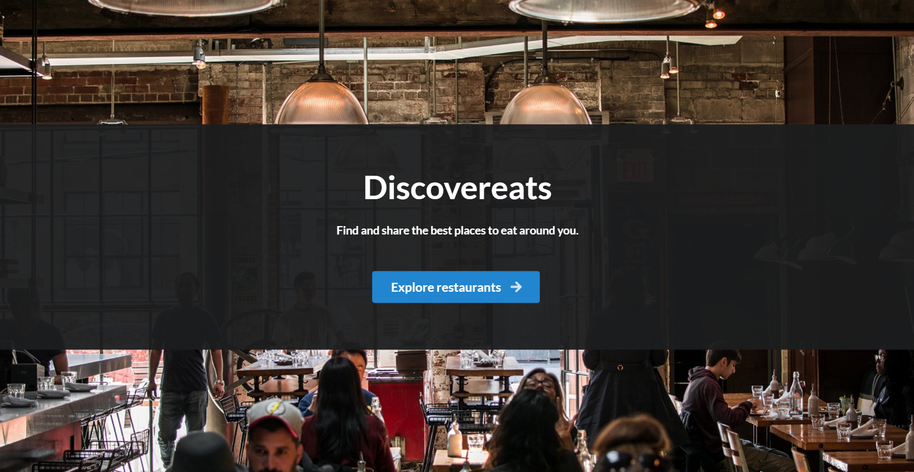
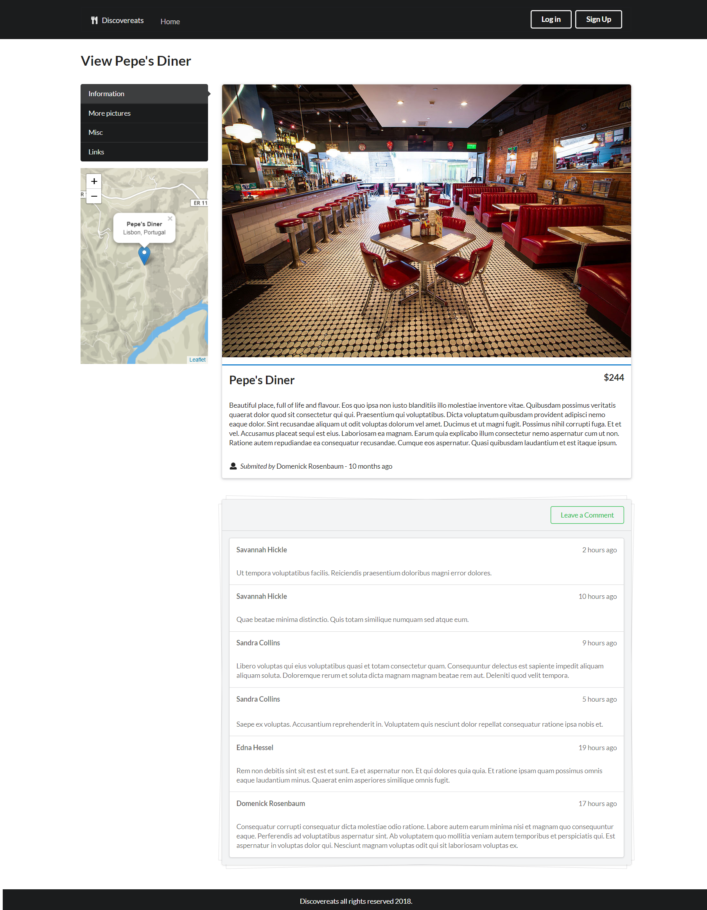
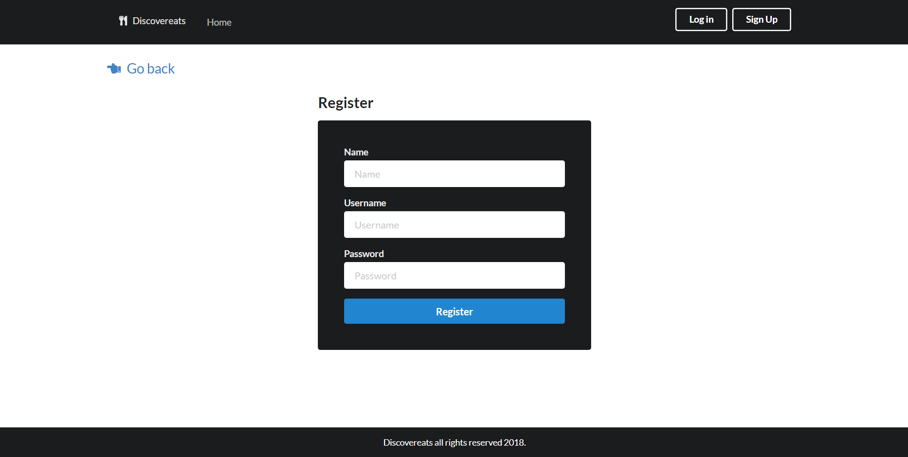

# Discovereats

## (Or my take on YelpCamp)

### Features

-   Project structure based on `express-generator`;
-   Better routing;
-   Controllers;
-   Database seededing with `faker.js`;
-   ES6 features used whenever possible (const, let, object destructuring, arrow functions, etc);
-   Semantic ui intead of bootstrap;
-   OpenCageData for geocoding intead of Google Maps;
-   Environment variables managed with `dotenv`;
-   Restaurants instead of campgrounds! 😬.

### To run

-   Create an .env file and define the `OPEN_CAGE_KEY` environment variable;
-   Run `mongod`, `npm i` and `npm start`.

### Screenshots

